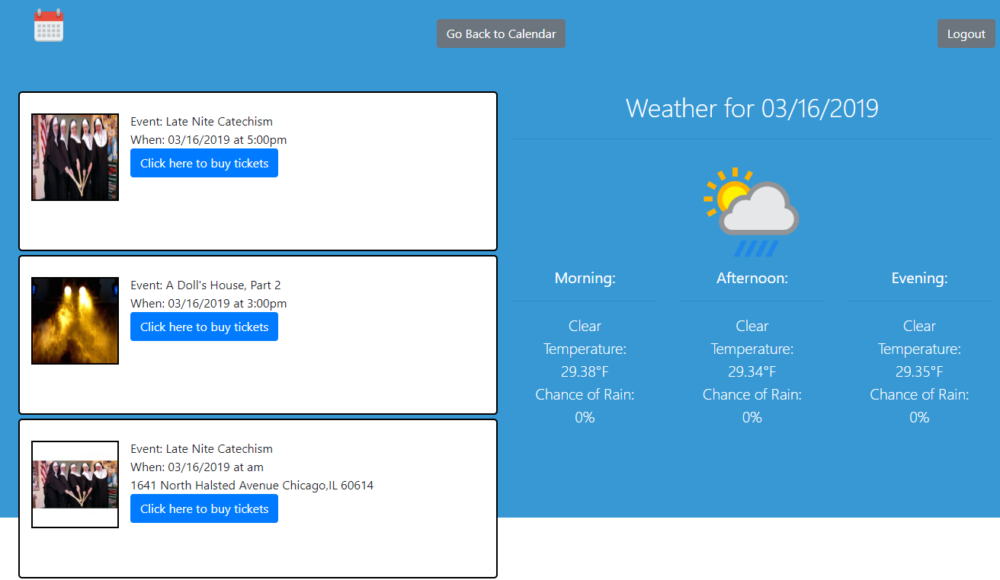

# PlanEasy
 
<strong>Deployed at:</strong> https://smushed.github.io/PlanEasy/ 
<strong>Title:</strong> PlanEasy 
<strong>Developers:</strong> Kevin Flerlage 
<strong>Last Update:</strong> 03/11/2019 
<strong>Developed With:</strong> HTML, Javascript, Firebase 

## **About This App**

Welcome to PlanEasy! This app allows users to sign in and connect with others by recording and comparing freetime between them. Please see the demo credentials below to give the app a try!
 
 
This is a single page web application that was originally for the first project of the Northwestern Full Stack Coding Bootcamp August Cohort.

## **Demo Credentials**

<strong>Email:</strong> test1@gmail.com
 
<strong>Password:</strong> 123456
 
 
<strong>Email:</strong> test2@gmail.com
 
<strong>Password:</strong> 123456
 

## **How to use this app**

After sign in the user is presented with the next seven days and the ability to choose what time they are free during those days. This comes in the form of icons. By clicking on an icon, it then writes to Firebase that the user is free and compares the freetime with all other users.
 
 

 
 
If the freetime they indicated matches with another user's freetime then a button is generated below the calendar. When pressed, the calendar is hidden, the event and weather API are queried and displayed when the app receives a response. From here the user gets any event data and the weather for that day. They are also displayed a link to book tickets to the event.
 
 

 
 
To go back to the calendar if they decide they don't want an event on that day, they press the button located on the top of the screen.

## Future Developments

In development is moving this application from a single page web app to an app utilizing the full MERN stack. Please see below for the current known issues and goals of the project. 
 
 
First step would be to integrate this application with Google Calendar and Outlook. Users can sign up with Google or Microsoft and add dates to their calendar for their freetime and then have a server match with their friends freetime.
 
 
As is, this application is not mobile friendly. On the next redesign, it would be a priority to make this mobile first as most scheduling is done with mobile phones
 
 
Additionally, this app currently only searches for data in Chicago rather than where the user is located. While we currently have the capability to do this with taking the user's ZIP on account creation, to get the weather for the event time proves difficult.